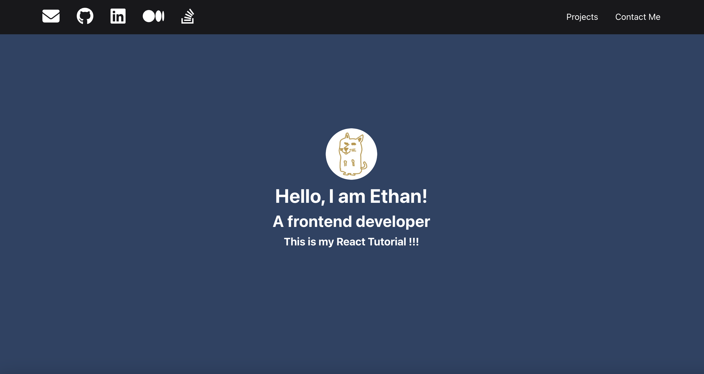
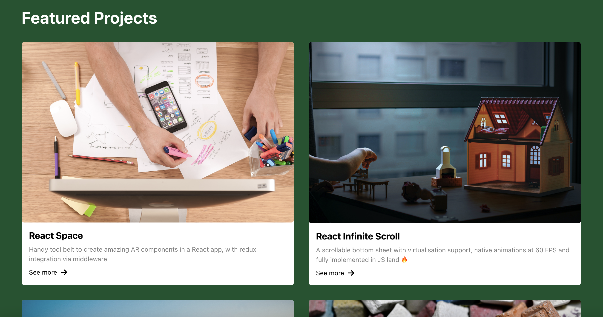
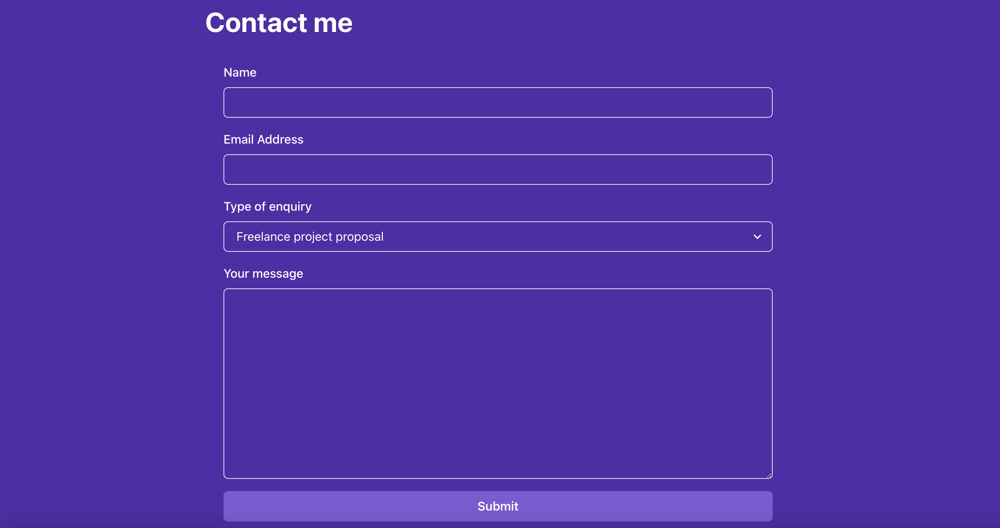

# Reactで作る自己紹介ページ

## 概要
ペライチのフォームがついた自己紹介ページ

## 使用したnpm
- Chakra UI
- Font Awesome
- Formik
- Yup

## 画面機能一覧
|  TOP  | 
| ---- |
|   FontAwesomeのアイコンを使用 transformでセクションまでスクロール|

|  Feature Projects | 
| ---- |
|   4×4のBoxを表示|

|  Contact Me | 
| ---- |
|   Formikでフォームの実装。Yepでバリデーションの実装。|
